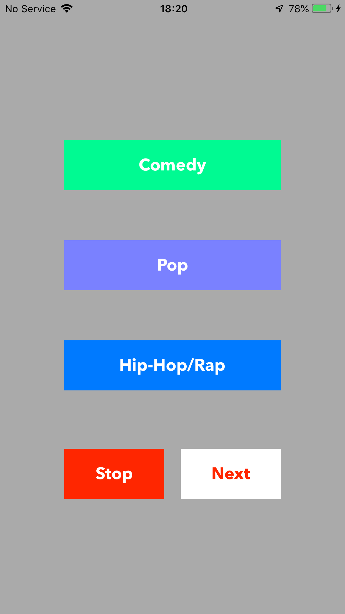

# MusicaPlayer
Music Player Example

Ejemplo sobre un Music Player sencillo que salta de genero por medio de tres botones, toma el genero dependiendo del nombre que tenga el boton que se presiona. Adicional tiene dos botones, Stop y Next.

Se modifico el info.plist para permitir acceder a Media Library Usage.

Se desarrollo con base en las enseñanzas de Sean Allen - Build Your First App

# Imagen de muestra.

